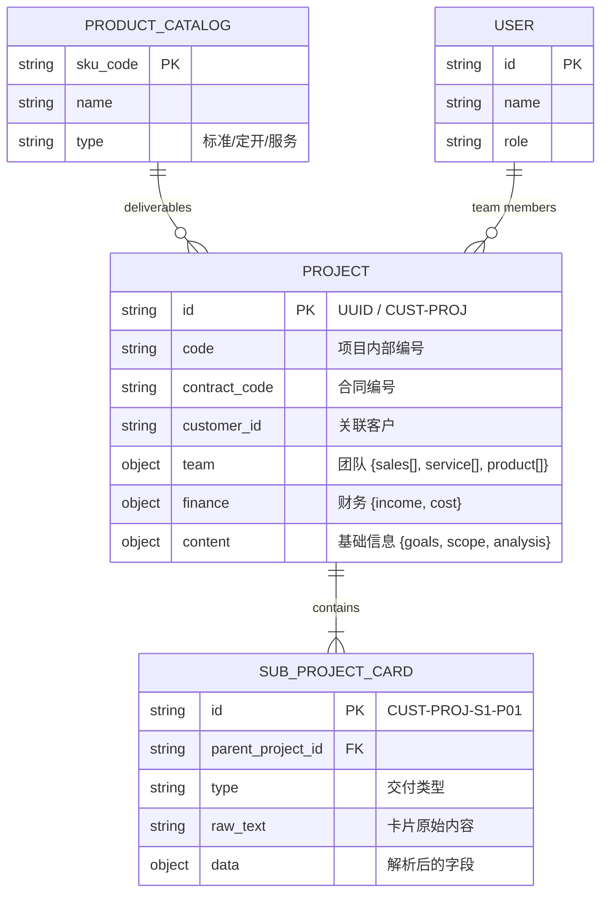

# 系统架构设计与演进规划

## 1. 核心理念
从“单列表卡片管理”向“多项目层级管理”演进，建立 **Project (项目) -> SubProject (子项目/卡片)** 的两级架构。
数据管理从分散的 JSON 文件逐步向结构化、关系型数据过渡，最终实现模块化融合（对接 CRM、业绩管理等）。

## 2. 实体关系模型 (ERD)



## 3. 数据存储架构 (JSON Schema V2)

### 3.1 基础主数据
- **`data/catalog.json`**: 货架清单库（产品/服务标准库）。
- **`data/users.json`**: 人员库（销售、交付、产品经理）。

### 3.2 业务数据
- **`projects.json`**: 项目级元数据。
- **`project_cards.json`**: 卡片级数据（子项目）。

## 4. 关键流程设计

### 4.1 项目创建与维护
1. 在“项目看板”创建新项目，录入合同、客户等信息。
2. 团队成员从 `users.json` 中选择（支持多选）。
3. 交付物从 `catalog.json` 中选择，或自由录入后回写到 `catalog.json`（需审核）。

### 4.2 子项目（卡片）关联
1. 入口：项目详情页 -> “新增卡片”。
2. 逻辑：自动携带 `parentId` 或 `projectPrefix`。
3. 编号：继承父级前缀，如 `1205-PROJ` -> `1205-PROJ-S1-P01`。
4. 归集：卡片保存时，根据编号前缀自动归属到对应项目。

### 4.3 预算聚合
- **模式 A (缺省)**: 使用项目手动录入的总预算。
- **模式 B (聚合)**: 自动累加所有关联子项目卡片中的预算字段。

## 5. 目录结构
```
.
├── server.py               # 后端服务 (API Gateway)
├── data/                   # 数据存储层
│   ├── projects.json       # 项目主表
│   ├── project_cards.json  # 子项目/卡片表
│   ├── catalog.json        # [新] 货架清单
│   └── users.json          # [新] 人员库
├── projects.html           # 项目看板 (入口)
├── project_detail.html     # 项目详情 (聚合页)
├── cardv8.html             # 卡片编辑器 (子项目)
├── project_timeline.html   # 全局/单项目时间表
└── docs/                   # 文档
```

## 6. 未来演进 (Phase 4+)
- **数据库化**: 引入 SQLite/PostgreSQL 替换 JSON 文件读写。
- **API 强化**: 拆分 `server.py` 为 MVC 架构 (Flask/FastAPI)。
- **外部集成**: 提供 Webhook 或标准 API 供 CRM 系统调用。
